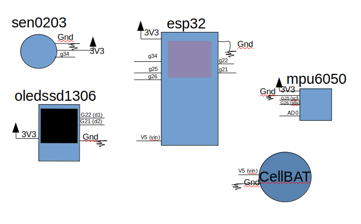

# Move Your Body

Code provided in this repository gets the raw data from MPU-6050 and SEN0203, calculates a step counter and heart rate, and stores it in the ESP-32 SPIFFS to be send via bluetooth to the MYB App. Also, comminicates with an Oled display via i2c to show in real time the data gathered, switching with a clock by using touch sensitive pins.

## Table of Contents

- [Components](#components)
  - [ESP 32](#esp-32)
  - [ESP-IDF](#esp-idf)
  - [MPU-6050](#mpu-6050)
  - [SEN0203](#sen0203)
  - [OLED_SSD1306](#OledDisplay)
- [Quick Start](#quick-start)
  - [Connect](#connect)
  - [Configuration and Flash](#configuration-and-flash)
- [How It Works](#how-it-works)
- [Next Steps](#next-steps)
  - [Software](#software)
- [License](#license)
- [Acknowledgments](#acknowledgments)

## Components

To make this code work, you need the following components:

* This repository. It contains submodules, so make sure you clone it with `--recursive` option. If you have already cloned it without `--recursive`, run `git submodule update --init`.
* [ESP 32](https://espressif.com/en/products/hardware/esp32/overview) module.
* [ESP-IDF](https://github.com/espressif/esp-idf).
* [MPU-6050](https://www.invensense.com/products/motion-tracking/6-axis/mpu-6050/) module.
* [SEN0203](https://wiki.dfrobot.com/Heart_Rate_Sensor_SKU__SEN0203) module.
* [OLED_SSD1306](https://cdn-shop.adafruit.com/datasheets/SSD1306.pdf) module.

### ESP 32

Any ESP 32 module should work.

### ESP-IDF

Configure your PC according to [ESP 32 Documentation](https://docs.espressif.com/projects/esp-idf/en/latest/?badge=latest?badge=latest). Windows, Linux and Mac OS are supported.

### MPU-6050

This example has been tested with a MPU-6050. 

The MPU-6000 should work aswell.

### SEN0203

By DFRobot, the great differential is that this sensor can read heart rate data from wrist, while most of the more well known devices just read precisely from fingers.

Also, it can be choosed both digital or analog connection by a switch, very easy to set up.

### OLED_SSD1306

Tested with the ssd1306 64x48 0.66", but with some fast adjustments in the code, it can be work with any other i2c based oled display.

## Quick Start

If you have your components ready, follow this section to [connect](#connect) the components to the ESP 32 module, [flash](#configuration-and-flash) the application to the ESP 32 and monitor the data.

### Connect

The pins used in this project to connect the ESP 32 to the MPU-6050 and MAX30100 are shown in the table below. The pinout can be adjusted in the software.

| Interface | MPU-6050 Pin | MAX30100 Pin | ESP 32 DevKitC Pin Mapping |
| :--- | :---: | :---: | :---: |
| I2C Serial Clock | SCL | SCL | IO25 |
| I2C Serial Data | SDA | SDA | IO26 |
| Power Supply 3.3V | VCC | VIN | 3V3 |
| Ground | GND | GND | GND |

Notes:

If the sensors are not communicating with the ESP 32, consider adding 10kΩ pull-up resistors to the SCL and SDA lines.



If you're using ESP 32 on Windows and is having the [ESP 32 Reset to Bootloader](https://github.com/espressif/esptool/issues/136) issue, add a 2.2uF capacitor conencted between GND and EN pins of ESP 32 module.

### Configuration and Flash

1. Clone the code provided in this repository to your PC.

2. To use the SPIFFS, you need a tool to create the SPIFFS partition image - we recommend using [igrr](https://github.com/igrr)'s [mkspiffs](https://github.com/igrr/mkspiffs).
After creating the SPIFFS image, use the `esptool` to flash the image binary to the module.
If you're gonna use the `partitions.csv` file, use the following configuration:
```
BLOCK SIZE = 4096
PAGE SIZE = 256
PARTITION SIZE = 0x2F0000
PARTITION OFFSET = 0x110000
```

3. On the `menuconfig`, use the following options:
```
Flash size: 4MB
Partition Table: Custom Partition Table CSV (choose the partitions.csv file)
```

4. Compile with the latest ESP-IDF installed from GitHub and download it to the module.

## How it Works

* component.mk - files used by C `make` command to access component during compilation.

Application is executed from [main.c](main/main.c) file located in main folder.
The main file has a step counter function, as well as log functions and routines that store the readings in the SPIFFS.

## Next Steps

Adjust the bluetooth data array to be sent to the mobile app.
Develop PCB and project design for the prototype.
Testing and validation.

## License

This project is licensed under the MIT License - see the LICENSE.md file for details.

## Acknowledgments

This application is using code based on:

* MPU-6050 implementation for Arduino by [Jeff Rowberg](https://www.i2cdevlib.com).
* SEN0203 implementation for Arduino by [DFRobot](https://github.com/DFRobot/DFRobot_Heartrate).
* OLED Display implementation for multiple devices by[olikraus](https://github.com/olikraus/u8g2).
